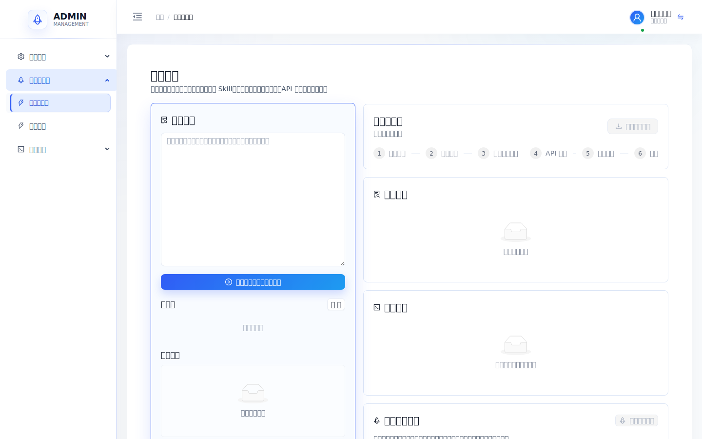
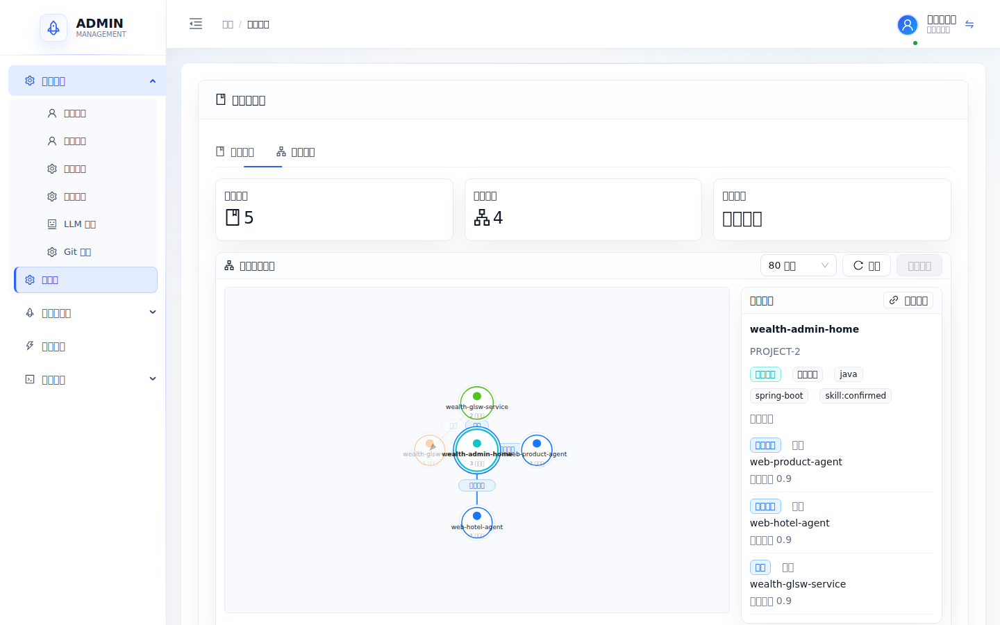
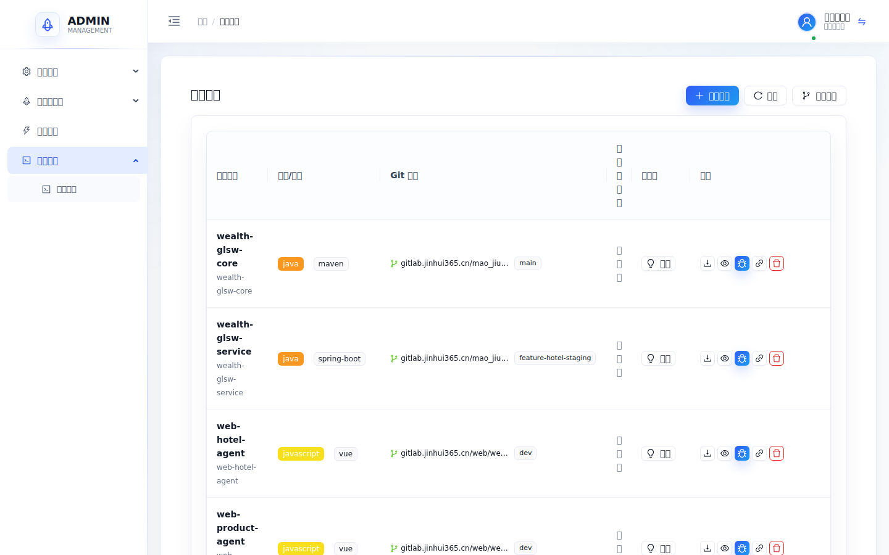

# Admin Platform - AI 驱动的项目生命周期工作台

> 通过 6 个 AI Agent 协作，覆盖从需求分析、页面设计、代码生成、测试验证到交付记录的开发流程。
> 支持多语言项目接入、项目级 Skill 沉淀、知识库检索、项目关系图谱和可验证的开发流水线。

Admin Platform 面向“把业务需求落到真实项目代码”的场景。它不是单纯的代码生成器，而是把项目源码分析、需求拆解、页面设计、原型预览、代码审查、自动化验证、知识沉淀串在一起的研发工作台。

> 说明：发布/部署模块当前处于设计和完善阶段，已有服务与页面骨架，但 README 中不把它描述为生产级发布能力。

## 当前状态

| 模块 | 状态 | 说明 |
|------|------|------|
| 项目接入与源码分析 | 可用 | 支持导入项目、识别技术栈、生成项目级 Skill |
| AI 开发流水线 | 可用/持续优化 | 需求、页面设计、原型、交付、审查、测试等阶段；子智能体评审关卡 + 阶段级重试 |
| 智能重试与人工介入 | 可用 | 阶段重试耗尽（默认 3 次）自动暂停进入 `needs_human`，介入队列集中处理 |
| AI 评测体系 | 可用/持续完善 | golden 用例、LLM-as-judge、评测看板（速度/成本/准确率/幻觉） |
| 项目知识库 | 可用 | 沉淀项目规则、接口契约、权限模型和验证方式 |
| 项目关系图谱 | 可用 | 展示前端、接口层、服务层、Core 项目之间的调用和依赖 |
| 原型预览校验 | 可用/持续优化 | 基于真实前端项目约束做预览生成、H5 沙箱启动和浏览器校验；无项目快照时从生成代码脚手架 Vue3+antd vite 沙箱并驱动 eval 视觉/E2E |
| 发布/部署 | 设计中 | 服务和入口存在，发布编排、审批、回滚、环境策略仍在完善 |
| 多租户/RBAC/配置 | 可用 | 支持用户、角色、菜单权限、LLM 配置、Git 配置 |

## 界面预览

### 开发流水线工作台



### 项目关系图谱



### 项目列表与图谱维护入口



## 工作流程

### 1. 接入项目

在「项目管理」中导入 Git 项目。系统会读取项目语言、框架、目录结构、路由、接口、权限模型和关键文件，并生成项目级 Skill。这个 Skill 会作为后续需求分析和代码生成的项目上下文。

### 2. 维护项目关系

项目分析完成后，系统会维护项目关系图谱。图谱默认只读取 `ProjectKnowledge`，用于表达“哪个前端调用哪个接口层、哪个接口层依赖哪个服务层、哪个服务层依赖哪个 Core 项目”，避免把流水线记录或普通知识条目混入关系图。

### 3. 发起需求流水线

产品或研发在「开发流水线」中输入需求，并选择前端/后端关联项目。流水线会按阶段生成需求分析、页面设计、原型预览、交付说明、代码审查和测试结果。对于现有页面改造，会优先匹配真实页面；对于新页面，会使用项目规则和相似页面作为参考。

### 4. 校验与修复

系统会结合项目 Skill、页面设计、API 契约和浏览器预览结果做自动校验。常见校验包括：主页面覆盖、接口 envelope、分页字段、权限按钮、组件使用、mock/fallback 边界、预览是否可打开等。

真实前端预览会把模型产物写入匹配项目的沙箱副本，并使用项目自己的启动脚本验证，而不是生成脱离项目的静态演示页。对于 `vue3-uniapp`、小程序和 H5 跨端项目，流水线会按真实应用目录生成页面文件，识别 pnpm workspace，选择 H5 预览脚本，并通过 `localhost/api/.../sandbox-preview/` 入口校验首屏渲染、路由、权限按钮和 API fallback。

需求、交付等关键阶段还会经过子智能体评审关卡：评审不通过即带反馈重生成，最多重试 3 次；重试耗尽不会让整条流水线失败，而是暂停进入 `needs_human`，把问题与涉及文件/行号写进流水线，等待人工修改后从「待人工介入」队列一键继续。

### 5. 自动测评

流水线交付后由 LLM-as-judge 自动打分（功能准确率、生成效果、幻觉），结果连同每次 LLM 调用的延迟、token、成本一起沉淀。在「AI 评测看板」可按时间窗口查看响应速度、调用成本、按模型/按阶段分布，以及准确率与幻觉率，用于持续度量生成质量。

其中**视觉评审与浏览器 E2E 断言**会按需启动真实沙箱预览（无项目快照时从生成代码脚手架 Vue3+antd vite 宿主，用完即停），由 GLM-4V 对真实渲染页截图打分、由 Playwright 断言期望控件是否存在——而非依赖静态渲染桩，让评测覆盖「真正渲染出来对不对」。

### 6. 知识沉淀

完成的项目分析、图谱复核和流水线交付会沉淀到知识库中，供后续需求匹配、上下文注入和图谱维护使用。

## 架构概览

```
┌──────────────────────────────────────────────────────┐
│            React Frontend (3000)                      │
│   Vite + Ant Design 5 + Zustand | 管理工作台 UI       │
└──────────────────────────────────────────────────────┘
                        │
                        ▼
┌──────────────────────────────────────────────────────┐
│            Go Gateway (8080)                          │
│   JWT 认证 → RBAC 权限 → 路由转发 → 限流 → 租户隔离   │
└──────────────────────────────────────────────────────┘
       │              │              │              │
       ▼              ▼              ▼              ▼
┌────────────┐ ┌────────────┐ ┌────────────┐ ┌────────────┐
│  Python    │ │Go Generator│ │  Go Deploy  │ │  Python    │
│  Backend   │ │  (8082)    │ │   (8083)    │ │   Agent    │
│  (8081)    │ │ 代码生成   │ │ Docker部署  │ │  (8084)    │
│ AI Agents  │ │ 项目管理   │ │ CI/CD流水线  │ │  语音/技能  │
└────────────┘ └────────────┘ └────────────┘ └────────────┘
       │              │              │
       ▼              ▼              ▼
┌──────────────────────────────────────────────────────┐
│  PostgreSQL (5432) + Redis (6379)                     │
└──────────────────────────────────────────────────────┘
```

## 技术栈

| 服务 | 技术 | 端口 | 说明 |
|------|------|------|------|
| React 前端 | Vite + Ant Design 5 + Zustand | 3000 | 项目、流水线、知识库管理工作台 |
| Go 网关 | Gin + JWT + Redis | 8080 | 统一入口，认证鉴权 |
| Python 后端 | FastAPI + SQLAlchemy | 8081 | 核心业务，AI Agent 编排 |
| Go 代码生成 | Gin + LLM API | 8082 | 项目模板，代码生成 |
| Go 部署 | Gin + Docker SDK | 8083 | 发布/部署能力设计中 |
| Go 配置中心 | Gin | 8085 | 系统配置管理 |
| PostgreSQL | 15+ | 5432 | 主数据库 |
| Redis | 7.x | 6379 | 缓存 + Session |

## 6 个 AI Agent

| Agent | 标识 | 职责 | 流水线阶段 |
|-------|------|------|-----------|
| 产品经理 | PM | 需求分析、PRD 文档 | requirement |
| 项目经理 | PJM | 任务拆分、API 契约、交付包 | delivery, commit |
| 前端开发 | FE | 前端页面开发 | frontend_dev, prototype |
| 后端开发 | BE | 后端 API 开发 | backend_dev |
| QA 工程师 | QA | 代码审查、自动化测试 | code_review, testing |
| 总结报告 | RPT | 进度汇总、日报 | report |

## 核心功能

### AI 开发流水线
- 从自然语言需求到可验证交付结果的阶段化流程
- 主要阶段：需求分析 → 页面设计 → 原型预览 → 交付包 → 前端开发 → 后端开发 → 代码审查 → 测试 → 提交 → 报告
- 前端/后端并行开发（Fan-out 模式）
- **子智能体评审关卡**：需求、交付等关键阶段产物由独立的 LLM-as-judge 评审（清晰度、功能点覆盖、契约完整性等），分数低于阈值即带反馈重生成
- **阶段级重试 → 人工介入**：校验/评审失败时自动带反馈重试（默认 `MAX_FIX_ITERATIONS=3`），重试耗尽不再硬性报废整条流水线，而是暂停进入 `needs_human` 状态，把阶段、问题清单、涉及文件/行号写进流水线，等待人工修改后一键继续
- 代码审查失败自动回退修复
- 每阶段可人工确认或自动执行
- 前端项目匹配会区分前端与后端技术栈，避免把 `javascript/vue/uni-app` 项目误归入 Java 后端候选
- 真实预览支持 npm、yarn、pnpm 和 workspace 项目，uni-app 项目以 H5 目标在浏览器中验证
- **后端沙箱真实起服务**（4b-2）：生成的 Java 工程在容器内本地 `mvn` 构建 + `java -jar` 起服务（动态端口、TCP 就绪探测），连独立的 `mysql-sandbox`；镜像走清华 apt + JDK18（华为云 tarball）绕开 docker hub 不可达
- **活契约审查**（4c）：`code_review` 阶段对真实起的后端发 HTTP 探针（`contract_prober` skill，三层断言：HTTP 状态 / JSON / `result.list` 或详情结构），契约不一致自动追加 mismatch 触发既有 fix-loop；`delivery` 交付结构化 `endpoints[]` 供探针消费
- **沙箱 DB/schema 灌入**（4b-3）：起服务前在 mysql-sandbox 建 per-pipeline 隔离库 + 灌 `schema.sql`
- **沙箱自动回收**：后台 reaper 每 60s 扫，空闲超时（默认 1800s）的前端 vite / 后端 java 沙箱进程自动 stop，防长跑泄漏
- **沙箱安全（三面收口）**：生成代码（LLM 产出、不可信）经统一原语执行——① **凭据**：`sanitized_env` 剔除 admin 凭据（`DATABASE_URL`/`JWT_SECRET`/`*_API_KEY` 等）；② **fs**：非 root 降权 uid 1500；③ **网络（Phase A，已 E2E 验证）**：`sandbox_execution_mode=container` 时所有 7 个 spawn 点（mvn/java/git/npm/vite/pytest/clone）跑在仅挂 `sandbox-net` 的隔离容器，只可达 mysql-sandbox + 互联网出站，**不可达 admin-network 的 postgres/redis/gateway**（admin-python 与 mysql-sandbox 双挂两网；`process` 模式为现状默认，本地/pytest 不破）。长驻 java/vite 经 `SandboxHandle`（`docker run -d` + `logs -f` + `stop`/`rm`），reaper + 启动孤儿清扫兜底；DB 库名注入防护 + sandbox user 仅 per-pipeline 库权限；探针 path SSRF 防护。**socket-proxy 收口（可选 overlay）**：admin-python 默认直挂 `/var/run/docker.sock`（信任级等同 admin-deploy）；用 `docker/docker-compose.sandbox-proxy.yml` overlay 可改走 `tecnativa/docker-socket-proxy` 白名单代理（仅放行 containers/images 管理，禁 exec/挂根卷/build/daemon），需 docker hub 可达——`docker compose -f docker-compose.yml -f docker-compose.sandbox-proxy.yml up -d` 启用

### 智能重试与人工介入
- 每个阶段维护独立重试计数，与 code_review/testing 的修复循环解耦，互不干扰
- 重试耗尽统一升级为 `needs_human`（非终态，不污染评测数据；重启后自然存活）
- 介入原因、问题项、文件/行号提示来自评审反馈、契约校验与 code_review 的字段位置信息
- 「待人工介入」队列（`/pipeline/intervention`）集中列出所有卡住的流水线，点击即跳回工作台
- 人工处理两路恢复：**人工通过并继续**（approve，标记完成推进到下一阶段）/ **带反馈重新生成**（retry，写回修订反馈再跑该阶段）
- 权限键校验已收紧：只在页面设计显式声明权限、且存在受保护页（非登录/注册类）时才校验，登录页等不再被误拦

### AI 评测体系
- **评测看板**（`/pipeline/ai-metrics`）：响应速度、调用成本、按模型/按阶段分布来自 `llm_usage_log`（按调用时间窗口过滤）；准确率、生成效果、幻觉率来自 `eval_run`（按评审时间窗口过滤）
- **Golden 用例 + 回归**（`/pipeline/eval-golden`）：维护标准用例，可一键触发无人值守流水线并自动打分；watcher 在流水线进入 `needs_human` 时停止，绝不自动放行。**一键跑全部回归**（`/run-all`，改 prompt/换模型后防退化）+ **回归历史**（`/runs/history`，按 case 聚合均分/通过率，对比前后质量）
- **LLM-as-judge**：低温 json 模式，复用为流水线内的子智能体评审官，并支持幻觉检测与视觉评判
- **评测可执行化 + 自治闭环**：eval 阶段的 judge/幻觉/视觉/E2E 分落 `pipeline_eval_result`（看板 `/pipeline/eval` 列表新增 Judge/幻觉/视觉/E2E 列，`extract_eval_scores` 统一抽取）；**质量门控**——LLM judge 分低于阈值（`eval_quality_gate_score`，默认 40）**先带反馈（judge 未过项/E2E/幻觉/视觉摘要）回到生成阶段重修**（`MAX_EVAL_FIX_ITERATIONS=2`，复用 fix-loop，重跑后自动再评，闭环），重修耗尽才升级 `needs_human`（judge 缺失 fail-open）——1 个开发流程可自治走完「生成→评测→低分重修→再评→达标」全闭环
- **人工评测**：看板行内可对交付打**人工覆盖分**（`human_score` + 评语，落 `pipeline_eval_result.human_*`，与 LLM 分并列校准、重跑 eval 不清零）；一键**从 pipeline 存为 Golden case**（`/eval/golden-cases/from-pipeline/{pid}`，取 `user_request` 作 `input_spec` + 参考产物，沉淀为回归基线）
- 调用级观测：每次 LLM 调用记录延迟、token 与成本，看板与流水线评审共享同一套数据源

### 项目知识库
- 导入 Git 项目后自动分析架构（语言、框架、API 规范、权限模型）
- 项目级 Skill：沉淀页面识别、路由菜单、接口契约、权限模型、验证命令等项目规则
- 上下文工程：语义检索 + 项目知识注入 LLM prompt
- 项目关系图谱：维护前端、接口层、服务层、Core 等关联项目之间的 `uses_api` / `depends_on` 关系
- 图谱维护闭环：重新分析项目 → 生成项目关系图谱 → 多角色规则审查 → 持久化图谱维护报告

### 项目关系图谱
- 入口：系统管理 → 知识库 → 知识图谱
- 数据源：默认读取项目知识库 `ProjectKnowledge`，不混入流水线交付记录或普通知识条目
- 展示能力：节点拖拽、画布平移缩放、关系箭头、关系标签、节点详情、相邻关系高亮
- 手动维护：项目列表页提供“重建图谱”，默认基于当前已分析项目快速复核和重建关系
- 自动维护：单项目“分析”会重新读取项目源码、更新 Project Skill，并同步刷新项目关系图谱
- 审查规则：检查重复节点、孤立节点、前端到接口层、接口层到服务层、服务层到 Core 的关系完整性

### 多语言代码生成
- Java Spring Boot + MyBatis-Plus
- PHP（BFF/API 转发层或 Laravel）
- Go Gin 微服务
- Python FastAPI
- Node.js / Vue / React 前端
- Vue3 / uni-app / H5 跨端前端预览

### 项目管理
- 项目导入（Git clone + 自动检测语言框架）
- 代码预览、下载、测试
- 关联 Git 配置、LLM 配置、知识库
- 手动触发项目分析和项目关系图谱维护

### 发布/部署（设计中）
- 当前已有部署服务和页面入口
- 环境策略、审批流、发布单、回滚、灰度和发布结果追踪仍在完善
- 暂不建议把当前部署模块作为生产发布中心使用

### 技能市场
- 内置 16 个技能（需求分析、代码审查、部署等）
- 支持新增、编辑、删除技能
- 技能自动被 AI Agent 调用

### 系统管理
- 多租户数据隔离（tenant_id）
- RBAC 权限体系（用户组 + 菜单权限）
- LLM 多提供商配置（智谱/Anthropic/OpenAI）
- Git 多平台配置（GitLab/GitHub/Gitee）

## 快速开始

### 环境要求

- Python 3.11+
- Go 1.21+
- Node.js 18+
- 真实前端预览容器使用 Node.js 22 + pnpm，兼容 pnpm workspace 与 `catalog:` 依赖协议
- PostgreSQL 15+
- Redis 7.x+

### 1. 初始化数据库

```bash
psql -U postgres -f database/schema.sql
```

### 2. 启动后端服务

```bash
# Python 后端 (AI Agents + 核心业务)
cd admin-python
pip install -e .
python -m app.main

# Go 网关
cd admin-gateway && go mod tidy && go run cmd/main.go

# Go 代码生成
cd admin-generator && go mod tidy && go run cmd/server/main.go

# Go 部署服务
cd admin-deploy && go mod tidy && go run cmd/server/main.go
```

### 3. 启动前端

```bash
cd admin-frontend
npm install
npm run dev
```

### 4. Docker Compose 一键启动

```bash
cd docker && docker-compose up -d
```

### 5. 访问系统

- 前端：http://localhost:3000
- API 文档：http://localhost:8081/docs
- 默认账号：`admin` / `admin123`

## 项目结构

```
admin-platform/
├── admin-python/          # Python 后端
│   └── app/
│       ├── ai/            # AI Agent 核心
│       │   ├── flow_manager.py          # 流水线引擎（编排胶水 + DevPipelineManager 核心类）
│       │   ├── pipeline_helpers.py          # 共享纯函数（页面路径/需求类型判定/强制转换）
│       │   ├── pipeline_project_context.py  # 项目上下文加载（git clone + 文件筛选 + 页面候选）
│       │   ├── pipeline_llm.py              # LLM 调用（重试+流式+超时+上下文裁剪）
│       │   ├── pipeline_page_design.py      # 页面设计解析（期望路径/组件/API 端点需求）
│       │   ├── pipeline_output_parse.py     # LLM 输出解析 + 代码审查结果归一化
│       │   ├── pipeline_preview_validation.py  # 前端预览代码覆盖校验 + 确定性补丁
│       │   ├── pipeline_eval_mixin.py          # DevPipelineManager eval 子域 mixin
│       │   ├── pipeline_queries_mixin.py       # DevPipelineManager 查询子域 mixin
│       │   ├── agents.py         # Agent 工厂
│       │   ├── skills.py         # 技能注册表
│       │   └── mcp_server.py     # MCP 协议
│       ├── api/           # API 路由
│       ├── core/          # 数据库、配置
│       ├── models/        # ORM 模型
│       ├── services/      # 业务逻辑
│       │   └── knowledge_service.py  # 知识库 + 语义搜索
│       └── skills/        # 技能定义 (SKILL.md)
├── admin-gateway/         # Go 网关 (JWT/权限/限流)
├── admin-generator/       # Go 代码生成 (模板/项目)
├── admin-deploy/          # Go 部署 (Docker/CI/CD)
├── admin-frontend/        # React 前端
│   └── src/
│       ├── pages/         # 页面
│       │   ├── pipeline/  # AI 开发流水线
│       │   ├── pipeline-intervention/  # 待人工介入队列
│       │   ├── pipeline-eval/          # 评测运行
│       │   ├── eval-golden/            # golden 用例
│       │   ├── ai-metrics/             # 评测看板
│       │   ├── project/   # 项目管理
│       │   ├── skills/    # 技能市场
│       │   └── webchat/   # AI 对话
│       ├── services/      # API 服务
│       └── utils/         # 工具函数
├── database/
│   ├── schema.sql         # 数据库建表脚本
│   └── migrations/        # 增量迁移（含待人工介入菜单等）
└── docker/
    └── docker-compose.yml # 容器编排
```

## 使用指南

### 创建 AI 开发流水线

1. 进入「开发流水线」页面
2. 输入需求描述，例如："创建一个用户管理模块，支持增删改查和角色分配"
3. 可选：关联后端项目（Java/Go/Python）和前端项目（Vue/React/PHP）
4. 点击"启动流水线"
5. AI 自动完成：需求分析 → 页面设计 → 原型 → 代码 → 测试；需求与交付阶段会经过子智能体评审，不通过自动带反馈重生成
6. 每阶段可人工审核确认，也可自动执行
7. 阶段重试耗尽会暂停进入待人工状态——到「待人工介入」队列处理：人工修改产物后「通过并继续」，或「带反馈重新生成」恢复流水线

### 查看评测看板

1. 进入「AI 评测看板」（`/pipeline/ai-metrics`）
2. 选择时间窗口（近 1 小时 / 6 小时 / 24 小时 / 7 天 / 30 天）
3. 查看响应速度、调用成本、按模型/按阶段分布，以及准确率、生成效果、幻觉率
4. 数据来自真实的 LLM 调用记录与 golden 用例评审结果，窗口越大包含的记录越多

### 导入项目

1. 进入「项目列表」页面
2. 点击"导入项目"
3. 输入 Git 仓库地址和分支
4. 系统自动检测语言和框架
5. 点击"分析"按钮，AI 自动分析项目架构

### 技能管理

1. 进入「技能市场」页面
2. 浏览分类和技能列表
3. 点击"新增技能"创建自定义技能
4. 技能会被 AI Agent 自动发现和使用

## API 端点

| 路径前缀 | 服务 | 说明 |
|---------|------|------|
| `/api/auth` | Gateway | 登录认证 |
| `/api/flow` | Python | AI 流水线（阶段推进、`/resume` 恢复、`/intervention/list` 介入队列） |
| `/api/skills` | Python | 技能系统 |
| `/api/system` | Gateway | 系统配置 |
| `/generator` | Generator | 代码生成 |
| `/deploy` | Deploy | 部署管理 |
| `/ws` | WebSocket | 实时通信 |

## License

MIT
